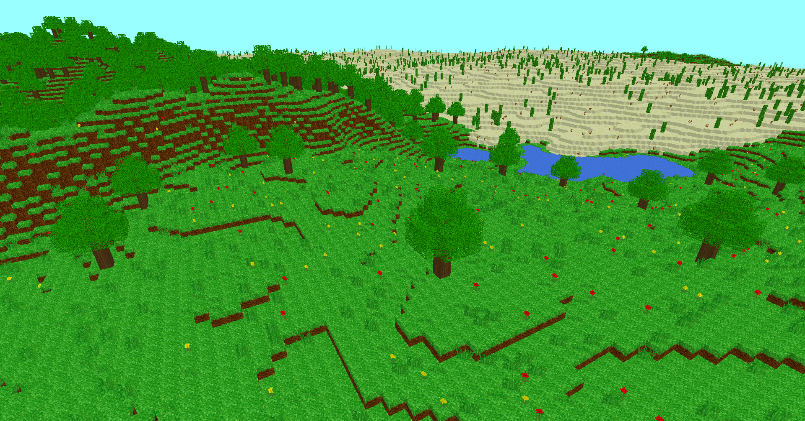

# Terraxel
Terraxel (formerly MineCrap) is a somewhat simple voxel-based game written in C++ with OpenGL 3.3<br>


## Features
-  Face Culling
-  Chunk based world generation
-  Block placing and breaking
-  Procedural terrain generation
-  Biomes
-  Multiple block models
-  Transparent and translucent blocks
-  Frustum Culling
-  Player physics & collisions
-  Giant world size

## Building from source
Before building the project, ensure you have the following installed:
- C++ compiler with C++17 (or later) support
- CMake (version 3.10 or higher)

### Windows
Clone the repository
```
git clone https://github.com/Fireroth/Terraxel.git
cd Terraxel
```

Run CMake
```
cmake -B build ./
```

Build the project
```
cmake --build build --config Release
```

### Linux
Clone the repository
```
git clone https://github.com/Fireroth/Terraxel.git
cd Terraxel
```

Run CMake
```
cmake -B build -DCMAKE_BUILD_TYPE=Release
```

Build the project
```
cmake --build build -j$(nproc)
```

## Libraries used
- [glfw](https://www.glfw.org/) – Window and input handling  
- [glad](https://github.com/Dav1dde/glad) – GL Loader-Generator
- [glm](https://github.com/g-truc/glm) – OpenGL math library
- [stb_image](https://github.com/nothings/stb) – Image loading  
- [ImGUI](https://github.com/ocornut/imgui) – GUI system
- [FastNoiseLite](https://github.com/Auburn/FastNoiseLite) – Noise generator (for terrain)
- [nlohmann/json](https://github.com/nlohmann/json) – JSON library

---

Honorable Mentions<br>
<sub>jdh - [YouTube](https://www.youtube.com/@jdh)<br> 
Low Level Game Dev - [YouTube](https://www.youtube.com/@lowlevelgamedev9330)<br> 
WSAL Evan - [YouTube](https://www.youtube.com/@wsalevan)<br> 
obiwac - [YouTube](https://www.youtube.com/@obiwac)<br> 
LearnOpenGL - [Website](https://learnopengl.com/)</sub>
